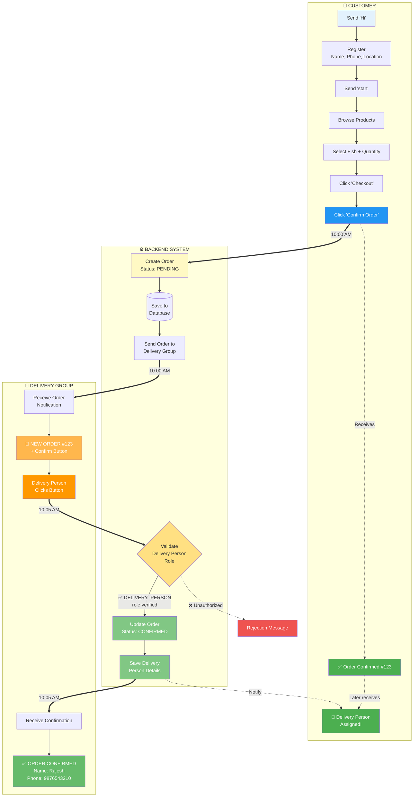
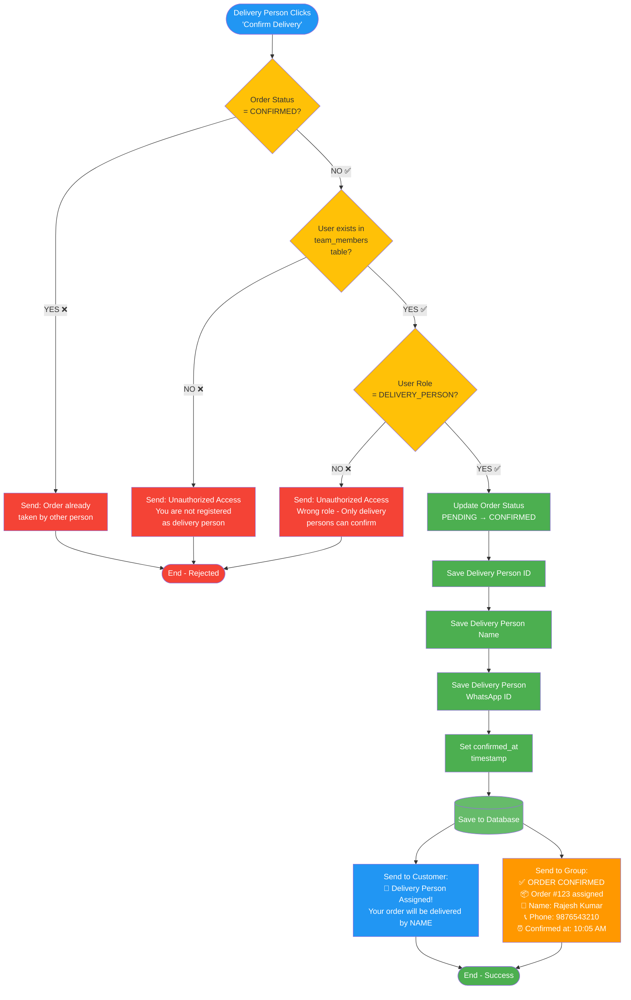
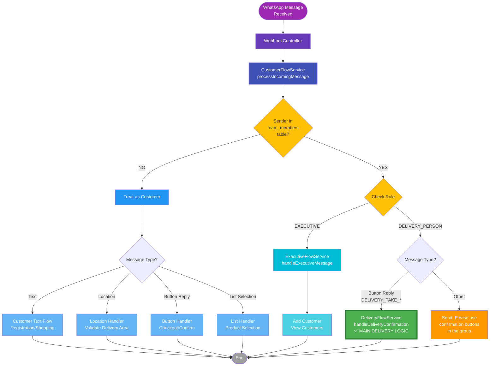
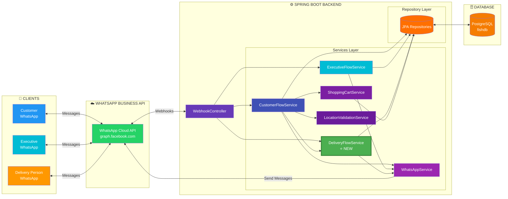
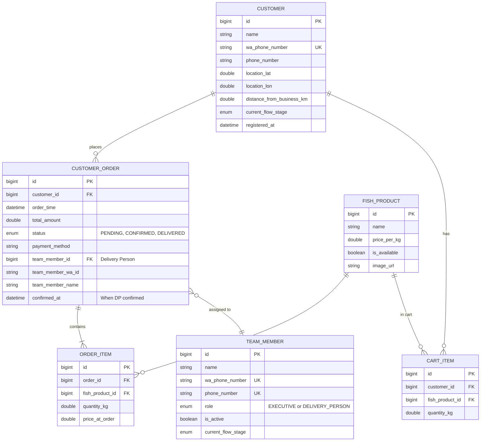

# WhatsApp Product Service - Visual Flow Diagrams

> **Note**: These diagrams use Mermaid syntax and can be viewed in:
> - GitHub (renders automatically)
> - VS Code with Mermaid extension
> - Online at https://mermaid.live (copy and paste the code)
> - Markdown preview tools

---

## 1. Complete Customer Order to Delivery Flow



---

## 2. Delivery Person Confirmation Logic (Detailed)



---

## 3. Message Routing Architecture



---

## 4. System Architecture Overview



---

## 5. Database Schema Relationships



---

## How to View These Diagrams

### Option 1: GitHub
1. Push this file to GitHub
2. Diagrams render automatically in markdown preview

### Option 2: VS Code
1. Install "Markdown Preview Mermaid Support" extension
2. Open this file and press `Ctrl+Shift+V` (Windows) or `Cmd+Shift+V` (Mac)

### Option 3: Online Viewer
1. Go to https://mermaid.live
2. Copy any diagram code block
3. Paste and view/export as PNG/SVG

### Option 4: Mermaid CLI (Generate PNG)
```bash
# Install mermaid-cli
npm install -g @mermaid-js/mermaid-cli

# Generate PNG from this file
mmdc -i FLOW_DIAGRAMS.md -o flow_diagram_1.png
```

---

## Legend

### Colors Used
- 🔵 **Blue**: Customer actions and flows
- 🟢 **Green**: Successful processes and confirmations
- 🟡 **Yellow**: Decision points and validations
- 🟠 **Orange**: Delivery group and delivery person actions
- 🔴 **Red**: Rejection/error flows
- 🟣 **Purple**: System components and controllers

### Arrow Types
- **Solid arrows (→)**: Direct flow/process
- **Dashed arrows (-.->)**: Notifications/messages sent
- **Thick arrows (==>)**: Main data flow with timestamp
