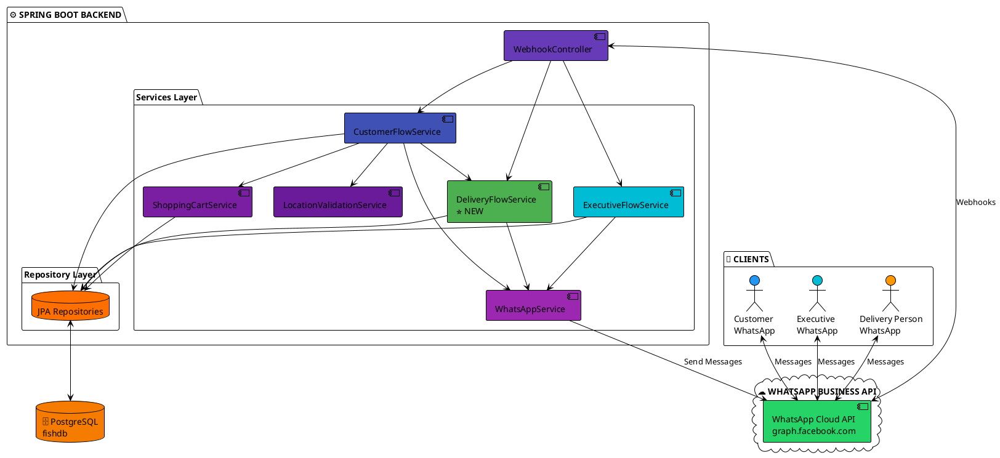
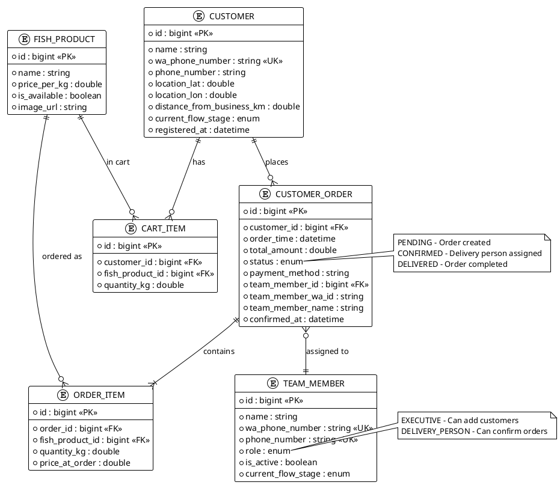
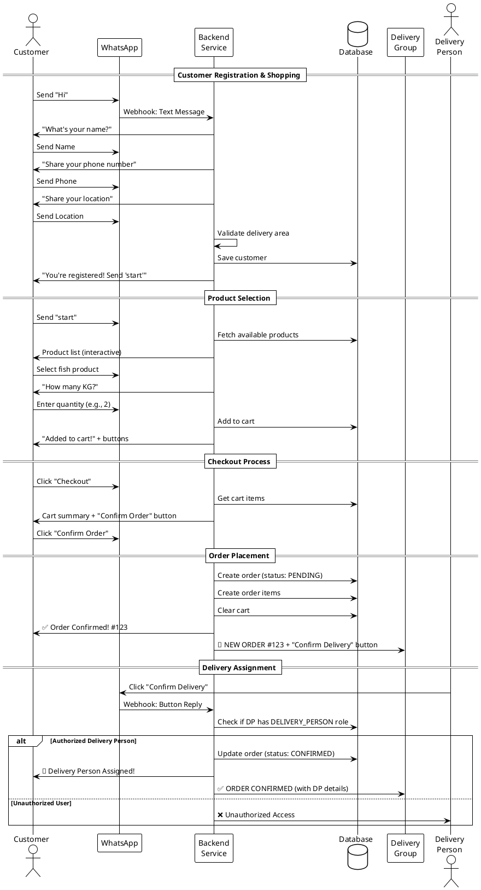
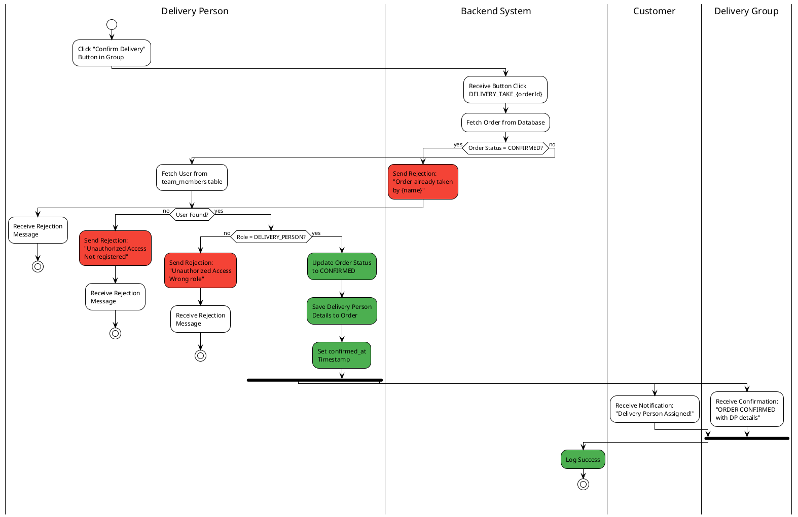

# WhatsApp Product Service - PlantUML Flow Diagrams

> **Note**: These diagrams use PlantUML syntax and can be viewed in:
> - VS Code with PlantUML extension
> - IntelliJ IDEA (built-in support)
> - Online at https://www.plantuml.com/plantuml/uml/
> - Generate PNG: `plantuml FLOW_DIAGRAMS_PLANTUML.md`

---

## 1. Complete Customer Order to Delivery Flow

```plantuml
@startuml
!define CUSTOMER_COLOR #E3F2FD
!define CUSTOMER_ACTION #2196F3
!define SUCCESS #4CAF50
!define BACKEND #FFF9C4
!define DECISION #FFE082
!define DELIVERY #FFB74D
!define ERROR #EF5350

skinparam backgroundColor white
skinparam defaultFontName Arial

rectangle "👤 CUSTOMER" as customer #E3F2FD {
    (Send 'Hi') as c1 #E3F2FD
    (Register\nName, Phone, Location) as c2 #E3F2FD
    (Send 'start') as c3 #E3F2FD
    (Browse Products) as c4 #E3F2FD
    (Select Fish + Quantity) as c5 #E3F2FD
    (Click 'Checkout') as c6 #E3F2FD
    (Click 'Confirm Order') as c7 #2196F3
    (✅ Order Confirmed #123) as c8 #4CAF50
    (🚚 Delivery Person\nAssigned!) as c9 #4CAF50
    
    c1 --> c2
    c2 --> c3
    c3 --> c4
    c4 --> c5
    c5 --> c6
    c6 --> c7
    c7 ..> c8 : Receives
    c8 ..> c9 : Later receives
}

rectangle "⚙️ BACKEND SYSTEM" as backend #FFF9C4 {
    (Create Order\nStatus: PENDING) as b1 #FFF9C4
    database "Save to\nDatabase" as b2 #FFE082
    (Send Order to\nDelivery Group) as b3 #FFF9C4
    diamond "Validate\nDelivery Person\nRole" as b4 #FFE082
    (Update Order\nStatus: CONFIRMED) as b5 #81C784
    (Save Delivery\nPerson Details) as b6 #81C784
    (Rejection Message) as x #EF5350
    
    b1 --> b2
    b2 --> b3
    b3 --> b4
    b4 --> b5 : ✅ DELIVERY_PERSON\nrole verified
    b5 --> b6
    b4 ..> x : ❌ Unauthorized
}

rectangle "📱 DELIVERY GROUP" as delivery #FFB74D {
    (Receive Order\nNotification) as d1 #FFB74D
    (🔔 NEW ORDER #123\n+ Confirm Button) as d2 #FFB74D
    (Delivery Person\nClicks Button) as d3 #FF9800
    (Receive Confirmation) as d4 #FFB74D
    (✅ ORDER CONFIRMED\nName: Rajesh\nPhone: 9876543210) as d5 #66BB6A
    
    d1 --> d2
    d2 --> d3
    d4 --> d5
}

c7 ==> b1 : 10:00 AM
b3 ==> d1 : 10:00 AM
d3 ==> b4 : 10:05 AM
b6 ..> c9 : Notify
b6 ==> d4 : 10:05 AM

@enduml
```

---

## 2. Delivery Person Confirmation Logic (Detailed)

```plantuml
@startuml
!theme plain
skinparam backgroundColor white
skinparam defaultFontName Arial

start
:Delivery Person Clicks\n'Confirm Delivery' Button;
#2196F3

if (Order Status\n= CONFIRMED?) then (YES)
  #F44336:Send: Order already\ntaken by other person;
  stop
else (NO)
  if (User exists in\nteam_members table?) then (NO)
    #F44336:Send: Unauthorized Access\nYou are not registered\nas delivery person;
    stop
  else (YES)
    if (User Role\n= DELIVERY_PERSON?) then (NO)
      #F44336:Send: Unauthorized Access\nWrong role - Only delivery\npersons can confirm;
      stop
    else (YES)
      #4CAF50:Update Order Status\nPENDING → CONFIRMED;
      #4CAF50:Save Delivery Person ID;
      #4CAF50:Save Delivery Person Name;
      #4CAF50:Save Delivery Person\nWhatsApp ID;
      #4CAF50:Set confirmed_at\ntimestamp;
      #66BB6A:Save to Database;
      
      fork
        #2196F3:Send to Customer:\n🚚 Delivery Person Assigned!\nYour order will be\ndelivered by NAME;
      fork again
        #FF9800:Send to Group:\n✅ ORDER CONFIRMED\n📦 Order #123 assigned\n👤 Name: Rajesh Kumar\n📞 Phone: 9876543210\n⏰ Confirmed at: 10:05 AM;
      end fork
      
      #4CAF50:Success;
      stop
    endif
  endif
endif

@enduml
```

---

## 3. Message Routing Architecture

```plantuml
@startuml
!theme plain
skinparam backgroundColor white
skinparam defaultFontName Arial

start
#9C27B0:WhatsApp Message\nReceived;

:WebhookController;
#673AB7

:CustomerFlowService\nprocessIncomingMessage();
#3F51B5

if (Sender in\nteam_members table?) then (NO)
  #2196F3:Treat as Customer;
  
  if (Message Type?) then (Text)
    #64B5F6:Customer Text Flow\nRegistration/Shopping;
    stop
  elseif (Location)
    #64B5F6:Location Handler\nValidate Delivery Area;
    stop
  elseif (Button Reply)
    #64B5F6:Button Handler\nCheckout/Confirm;
    stop
  else (List Selection)
    #64B5F6:List Handler\nProduct Selection;
    stop
  endif
  
else (YES)
  if (Check Role) then (EXECUTIVE)
    #00BCD4:ExecutiveFlowService\nhandleExecutiveMessage;
    #4DD0E1:Add Customer\nView Customers;
    stop
    
  else (DELIVERY_PERSON)
    if (Message Type?) then (Button Reply\nDELIVERY_TAKE_*)
      #4CAF50:**DeliveryFlowService**\n**handleDeliveryConfirmation**\n✅ MAIN DELIVERY LOGIC;
      note right
        This is the core
        delivery confirmation
        logic with role
        validation
      end note
      stop
    else (Other)
      #FF9800:Send: Please use\nconfirmation buttons\nin the group;
      stop
    endif
  endif
endif

@enduml
```

---

## 4. System Architecture Overview



---

## 5. Database Schema Relationships



---

## 6. Sequence Diagram - Complete Order Flow



---

## 7. Activity Diagram - Delivery Confirmation Process



---

## How to Use PlantUML Diagrams

### Option 1: VS Code
1. Install "PlantUML" extension by jebbs
2. Open this file
3. Press `Alt+D` to preview diagrams
4. Right-click diagram → "Export Current Diagram" to save as PNG/SVG

### Option 2: IntelliJ IDEA
1. Built-in PlantUML support
2. Open this file
3. Diagrams render automatically in preview

### Option 3: Online Viewer
1. Go to https://www.plantuml.com/plantuml/uml/
2. Copy any diagram code
3. Paste and view/download

### Option 4: Command Line
```bash
# Install PlantUML
# Download from https://plantuml.com/download

# Generate all diagrams as PNG
java -jar plantuml.jar FLOW_DIAGRAMS_PLANTUML.md

# Generate as SVG
java -jar plantuml.jar -tsvg FLOW_DIAGRAMS_PLANTUML.md
```

### Option 5: Docker
```bash
# Run PlantUML server
docker run -d -p 8080:8080 plantuml/plantuml-server:jetty

# Access at http://localhost:8080
```

---

## Color Legend

- **#2196F3** - Customer actions (Blue)
- **#4CAF50** - Success/Confirmed (Green)
- **#FF9800** - Delivery person actions (Orange)
- **#F44336** - Errors/Rejections (Red)
- **#FFC107** - Decisions/Validations (Yellow)
- **#9C27B0** - System components (Purple)
- **#00BCD4** - Executive flow (Cyan)

---

## Diagram Types Included

1. **Component Diagram** - System architecture
2. **Flowchart** - Delivery confirmation logic
3. **Activity Diagram** - Message routing
4. **Entity Relationship Diagram** - Database schema
5. **Sequence Diagram** - Complete order flow
6. **Activity Diagram** - Delivery confirmation process
